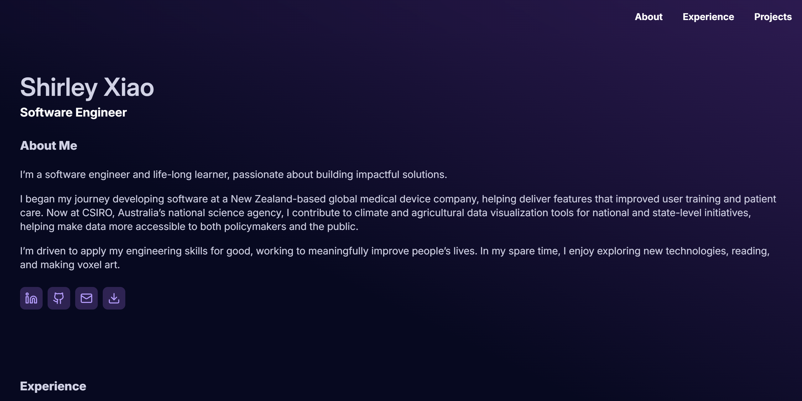
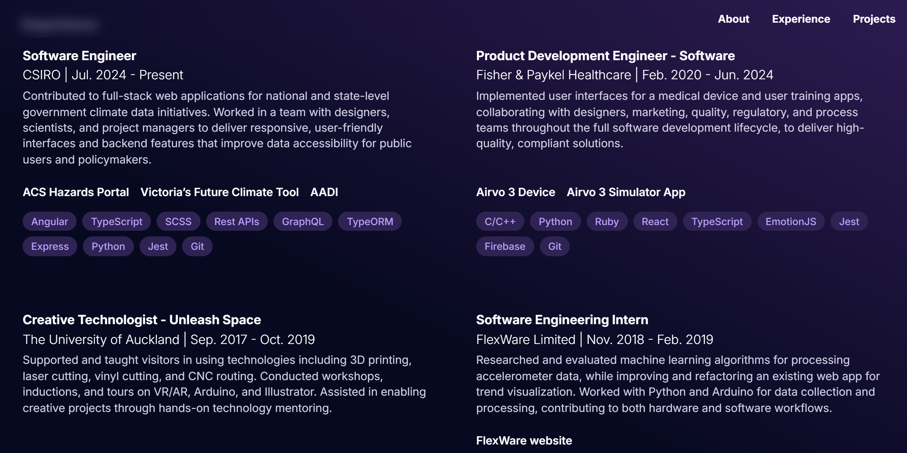
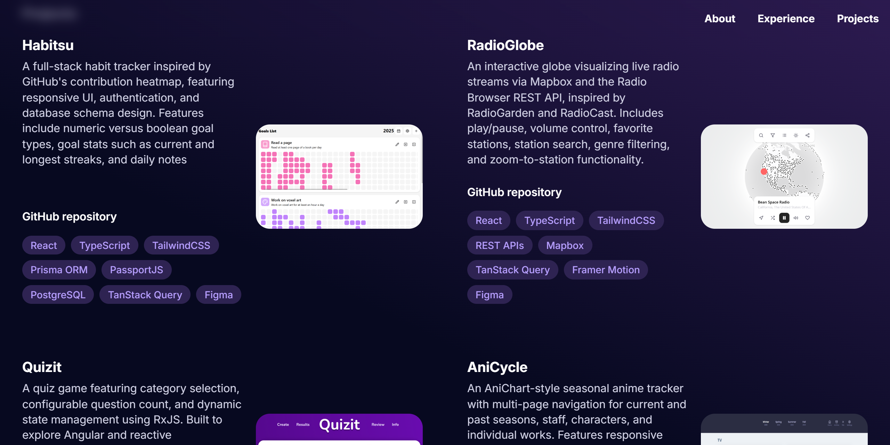

# Personal Site

My personal site, built with **Astro** and hosted with **Github Pages**.

## Overview

Personal site with sections on:
- About Me
- Experiences
- Projects

## Tech Stack

| Category      | Technology |
|---------------|------------|
| Framework     | [Astro](https://astro.build) |
| Language      | [TypeScript](https://www.typescriptlang.org) |
| Styling       | [CSS](https://developer.mozilla.org/en-US/docs/Web/CSS) |
| Content       | [Markdown (GFM)](https://github.github.com/gfm/) |
| Hosting       | [Github Pages](https://docs.github.com/en/pages) |
| Design / Prototyping | [Figma](https://figma.com) |

## Screenshots

| About | Experiences | Projects |
|-------|-------------|----------|
|  |  |  |

## Getting Started

Commands for setting up and running the site are as follows:

| Command                   | Action                                           |
| :------------------------ | :----------------------------------------------- |
| `npm install`             | Installs dependencies                            |
| `npm run dev`             | Starts local dev server at `localhost:4321`      |
| `npm run build`           | Build your production site to `./dist/`          |
| `npm run preview`         | Preview your build locally, before deploying     |
| `npm run astro ...`       | Run CLI commands like `astro add`, `astro check` |
| `npm run astro -- --help` | Get help using the Astro CLI                     |

## Contributors
Shirley Xiao - [Github](https://github.com/shirley543) - [LinkedIn](https://www.linkedin.com/in/shirley543)
